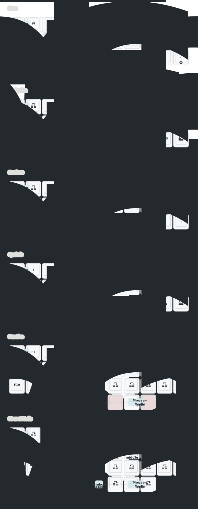

# Crosses (MiaoMiao variant)

A wireless 36-key split ergonomic keyboard with dual PMW3610 trackballs, built on nice!nano v2 with ZMK firmware.


## Keymap



## Philosophy

This build is about doing more with less. The goal is a 36-key layout that minimises chording while giving full access to every key you need — numbers, symbols, function keys, navigation, and mouse control — without ever reaching for a separate pointing device. Layers activate through thumb combos rather than dedicated keys, keeping the base layout clean and fluent with macOS shortcuts and modifiers as first-class citizens. The dual trackballs integrate into the layer system so each thumb side has a natural role: cursor on the right, scroll on the left. The result is a genuinely mouseless setup that doesn't sacrifice the fluency of a standard Mac layout.

## Features

- **36 keys** — 3×5 + 3 thumb keys per side
- **Dual PMW3610 trackballs** — right for cursor, left for scroll
- **6 layers** — Base, NAV, NUM, SYM, FUN, MOUSE — all activated via thumb combos
- **Caps Word** — smart capitalisation for typing `SCREAMING_SNAKE_CASE`
- **ZMK Studio** — real-time keymap editing via USB (right side)
- **Keyboard Layers App** — companion app to display active layer on a secondary screen
- **Battery reporting** — charge level proxied from both halves to the host
- **Bluetooth** — up to 5 device profiles, BT 4.0 compatible

## Hardware

| Component | Specification |
|-----------|---------------|
| MCU | nice!nano v2 |
| Switches | Kailh Choc |
| Trackball sensor | PMW3610 (×2) |
| Firmware | ZMK v0.3.0 |

## Building Firmware

### Option 1: GitHub Actions

Push changes to the repository and GitHub Actions will automatically build the firmware. Download the `.uf2` files from the Actions artifacts.

### Option 2: Local Build with Docker (Recommended)

Faster for iterating on config changes and gives direct access to the ZMK framework.

#### Prerequisites

```bash
# Install Docker, then pull the ZMK image
docker pull zmkfirmware/zmk-dev-arm:stable
```

#### Build Commands

```bash
# First time: initialize ZMK workspace (only needed once, ~5-10 min)
./build-local.sh init

# Build all firmware (left, right, settings_reset)
./build-local.sh all

# Build individual sides
./build-local.sh left    # Left side only
./build-local.sh right   # Right side (with ZMK Studio)
./build-local.sh reset   # Settings reset firmware

# Maintenance
./build-local.sh clean   # Clear builds, keep ZMK cache
./build-local.sh purge   # Delete everything, start fresh
```

#### Output

Firmware files will be in the `./firmware/` folder:
- `nice_nano_v2-crosses_left.uf2`
- `nice_nano_v2-crosses_right.uf2`
- `nice_nano_v2-settings_reset.uf2`

## Flashing

1. **Enter bootloader**: Double-tap the reset button on your nice!nano
2. **Mount**: A USB drive named `NICENANO` will appear
3. **Flash**: Drag the `.uf2` file to the drive
4. **Repeat** for the other half

## Troubleshooting

If you have Bluetooth pairing issues:
1. Flash `settings_reset.uf2` to **both** halves
2. Remove the keyboard from your computer's Bluetooth settings
3. Flash the regular firmware to both halves
4. Re-pair

## Trackball

Each half has a PMW3610 trackball with a dedicated role:

- **Right trackball** — cursor control at all times
- **Left trackball** — dedicated scroll; horizontal movement is suppressed so only vertical scroll fires (prevents terminals interpreting horizontal movement as arrow keys)

CPI is 1600 with a 4× divider (effective 400 CPI) for comfortable everyday movement. Snipe mode drops to 200 CPI for precision work. Mouse buttons (left/middle/right click) are available on the MOUSE layer, toggled via a right thumb combo.

## ZMK Studio

The right side has ZMK Studio enabled. Connect via USB and visit [ZMK Studio](https://zmk.studio) to edit your keymap in real-time without rebuilding firmware.

## Keyboard Layers App

Display your active keyboard layer on a secondary screen (tablet, phone, or spare monitor) to help memorise key positions while you're learning the layout.

Details: https://github.com/maatthc/keyboard_layers_app_companion

## Keymap Drawer

The keymap visualisation is automatically regenerated by GitHub Actions whenever you push changes to `config/crosses.keymap`, `config/*.dtsi`, or `keymap_drawer.config.yaml`. Output is saved to `keymap-drawer/`.

### Manual Generation

```bash
# Install keymap-drawer
pip install keymap-drawer

# Parse the keymap
keymap -c keymap_drawer.config.yaml parse -z config/crosses.keymap > keymap.yaml

# Draw the SVG
keymap -c keymap_drawer.config.yaml draw keymap.yaml > keymap.svg
```

The `keymap_drawer.config.yaml` file controls styling, glyphs, and how ZMK keycodes are rendered.

## Configuration Files

| File | Purpose |
|------|---------|
| `config/crosses.keymap` | Keymap and layers |
| `config/crosses.conf` | Global settings (sleep, Bluetooth) |
| `config/boards/shields/crosses/crosses_left.conf` | Left side — trackball peripheral |
| `config/boards/shields/crosses/crosses_right.conf` | Right side — central, ZMK Studio |

## Credits

- [HeeTuic - Crosses ZMK build](https://github.com/HeeTuic/zmk-for-crosses)
- [GGGW Crosses Keyboard](https://github.com/Good-Great-Grand-Wonderful/crosses)
